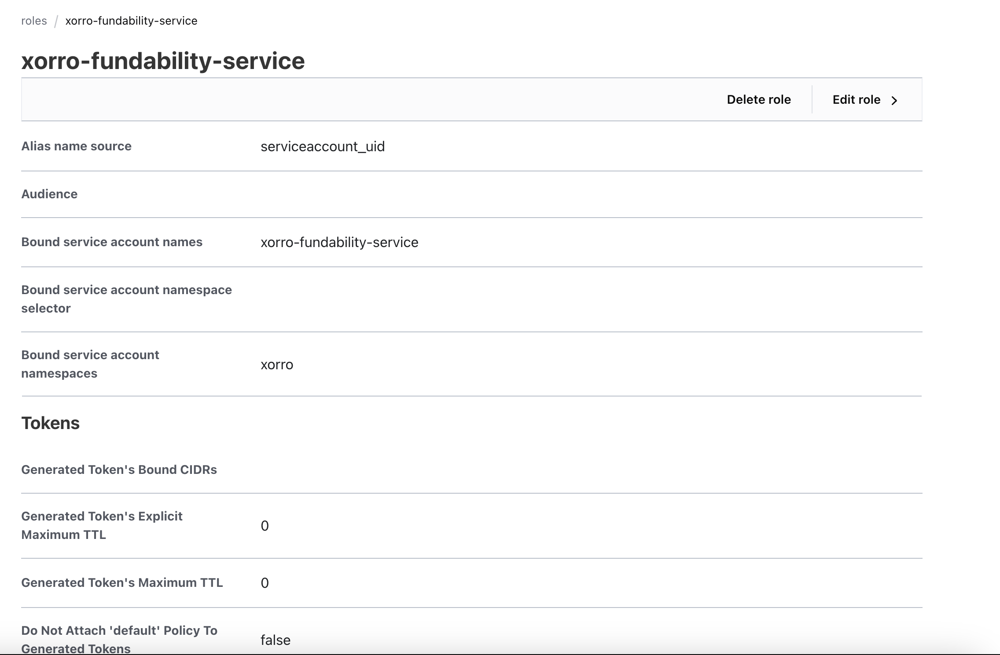
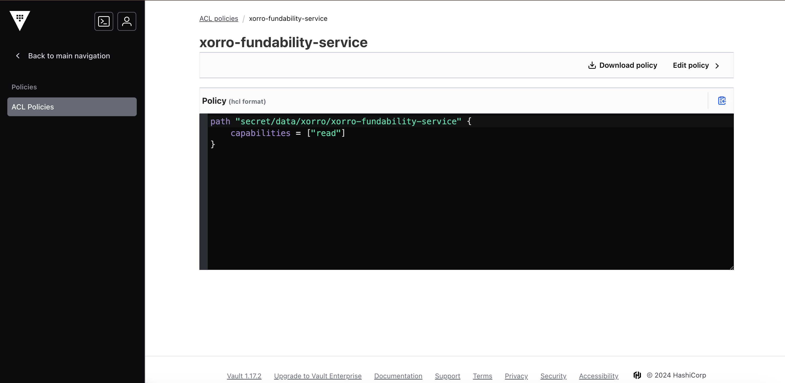

# argo-xorro-stage
Argocd repository for xorro-stage environment

## Description
This repository contains helm manifest to setup Xorro services in EKS cluster for STAGE environments.

## Architecture

Figma link: [Xorro Architecture](https://www.figma.com/board/vAqKGiph3gXms4Pok4CKcm/Xorro-Architecture?node-id=0-1&node-type=canvas&t=G8qFCZcqUghx2U4D-0)


## Cloud Services

| Service                                                       | Purpose                                                                                                                                         | Reference                                                   |
|---------------------------------------------------------------|-------------------------------------------------------------------------------------------------------------------------------------------------| ----------------------------------------------------------- |
| Appsmith                                                      | Prepare dashboards for business/operations/admin/support functions                                                                              | https://www.appsmith.com/                                   |
| ArgoCD                                                        | GitOps continuous delivery tool for Kubernetes                                                                                                  | https://argo-cd.readthedocs.io/en/stable/                   |
| Cert-Manager                                                  | Certificates management                                                                                                                         | https://cert-manager.io/docs/                               |
| Date Prepper                                                  | Data collector capable of filtering, enriching, transforming, normalizing and aggregating data <br/>for downstream analytics and visualization. | https://opensearch.org/docs/1.2/clients/data-prepper/index/ |
| Dex                                                           | OpenID Connector for Single Sign-on                                                                                                             | https://dexidp.io/                                          |
| External DNS                                                  | Synchronizes exposed Kubernetes Services and Ingresses with DNS providers                                                                       | https://github.com/kubernetes-sigs/external-dns             |
| Fluent Bit                                                    | Fast Log Processor and Forwarder                                                                                                                | https://github.com/fluent/fluent-bit                        |
| Emissary                                                      | Ingress controller                                                                                                                              | https://docs.solo.io/gloo-edge/latest/                      |
| Prometheus Operator<br/>(Prometheus + AlertManager + Grafana) | Metrics                                                                                                                                         | https://prometheus.io/                                      |

## Folder Structure

| Folder Name                                      | Usage                                                                                                                                                    |
|--------------------------------------------------|----------------------------------------------------------------------------------------------------------------------------------------------------------|
| [infra/aws-apps](./infra/aws-apps)               | Deploy aws drivers in this folder. AWS drivers are required to access AWS services from EKS                                                              |
| [infra/infra-apps](./infra/infra-apps)           | Deploy open-source tools or services in this folder. e.g. Grafana, Karpenter etc.                                                                        |
| [infra/manifests](./infra/infra-manifests)       | Setup secrets, service accounts and other Kubernetes objects required by infra-apps                                                                      |
| [ingress/ingress-apps](./ingress/ingress-apps)   | Deploy Ingress Controller in this folder                                                                                                                 |
| [ingress/manifests](./ingress/ingress-manifests) | Deploy secrets or other manifests objects required by Ingress Controller.                                                                                |
| [ingress/ingress-rules](./ingress/ingress-rules) | Deploy ingress rules under this folder using [helm-nst-ingress](https://github.com/newsocialtheory/helm-nst-ingress) chart. Base domain: xorro-stage.com |
| [xorro/xorro-apps](./xorro/xorro-apps)           | Deploy apps required by Xorro application.                                                                                                               |
| [xorro/xorro-manifests](./xorro/xorro-manifests) | Deploy Xorro apps in this folder using [helm-nst-service](https://github.com/newsocialtheory/helm-nst-service) chart.                                    |

## Deploy a Service

We use custom helm chart [helm-nst-service](https://github.com/newsocialtheory/helm-nst-service) to deploy services in EKS cluster.
Refer README.md in [helm-nst-service](https://github.com/newsocialtheory/helm-nst-service) to understand NST Helm Chart. 

### Chart Example

**Chart.yaml**
```yaml
apiVersion: v2
name: xorro-fundability-service #You need to change the service name
type: application
version: v1.0.0
appVersion: "v1.0.0"
dependencies:
- name: service
  version: v1.0.0
  repository: oci://024848447392.dkr.ecr.ap-southeast-1.amazonaws.com/nst/helm

```

**values.yaml**
```yaml
service:
  fullNameOverride: "xorro-fundability-service" #You need to change the service name
  NST: &env
    environment: "stage"
    project: "xorro"
    vertical: "xorro"
  workload:
    enabled: true
    scheduling:
      minAvailable: 1
    deployment:
      replicas: 1
      rollingUpdate:
        maxSurge: 100%
        maxUnavailable: 1
    podTemplate:
      annotations:
        config.linkerd.io/skip-outbound-ports: "8200,3306"
        vault.hashicorp.com/agent-inject: 'true'
        vault.hashicorp.com/agent-pre-populate-only: 'true'
        vault.hashicorp.com/role: 'xorro-fundability-service' #This needs to match with the service name
        vault.hashicorp.com/agent-inject-default-template: 'json'
        vault.hashicorp.com/agent-inject-secret-secrets.yml: 'secret/data/xorro/xorro-fundability-service' #This needs to match with the service name
        vault.hashicorp.com/agent-inject-template-secrets.yml: |
          {{- with secret "secret/data/xorro/xorro-fundability-service" -}} #This needs to match with the service name
            {{ .Data.data.secrets }}
          {{- end -}}
      defaultContainer:
        image:
          name: 024848447392.dkr.ecr.ap-southeast-1.amazonaws.com/xorro/xorro-fundability-service #This is service docker image path in ECR
          tag: "v1.5.0" #This is the version you want to deploy
        containerPorts:
          - containerPort: &http 8090 #This is the port number exposed by the service
        env:
          - name: MICRONAUT_CONFIG_FILES
            value: "file:/vault/secrets/secrets.yml"
        resources: #Memory and CPU needs to assign to the service
          requests:
            cpu: 100m
            memory: 128Mi
          limits:
            cpu: 200m
            memory: 256Mi
        startupProbe:
          httpGet:
            path: /health #This is the endpoint to monitor the health of the service
            port: *http
        readinessProbe:
          httpGet:
            path: /health
            port: *http
        livenessProbe:
          httpGet:
            path: /health
            port: *http
  service:
    enabled: true
    ports:
      - name: http
        port: *http
  autoscaling: #Enable HPA for the service
    enabled: true
    minReplicas: 2
    maxReplicas: 5
    targetCPUUtilizationPercentage: 70
    behavior:
      scaleDown:
        stabilizationWindowSeconds: 300
        policies:
          - type: Pods
            value: 1
            periodSeconds: 180
      scaleUp:
        stabilizationWindowSeconds: 300
        policies:
          - type: Pods
            value: 1
            periodSeconds: 60
````

Check more examples in [helm-nst-service/examples](https://github.com/newsocialtheory/helm-nst-service/tree/main/helm/service/examples)
## Deploy Ingress
**values.yaml**
```yaml
provider: emissary
virtualServices:
  default:
    enabled: true
    certificate:
      create: true
    hosts:
      - api.xorro-stage.com. #Domain
    httpRoutes:
      - match:
          - uri:
              regex: /auth/(.*) #This is the endpoint to route the request
        action:
          route:
            - host: auth-service.xorro
              port: 8082
        options:
          timeout: "30000" #milliseconds #This is the timeout for the service
          rewrite:
            uriRegex:
              pattern: /auth/(.*)
              substitution: /\1
      - match:
          - uri:
              regex: /fundability/(.*)
        action:
          route:
            - host: xorro-fundability-service.xorro
              port: 8090
        options:
          timeout: "30000" #milliseconds
          rewrite:
            uriRegex:
              pattern: /fundability/(.*)
              substitution: /\1
```

Check more detailed information in [helm-nst-ingress](https://github.com/newsocialtheory/helm-nst-ingress/blob/main/README.md)

Check more examples in [helm-nst-ingress/examples](https://github.com/newsocialtheory/helm-nst-ingress/tree/main/helm/api/examples)
## Add Secret in Vault
Login to Xorro AWS account and EKS
```shell
unset AWS_VAULT
aws-vault exec sso-xorro-stage
aws eks --region ap-southeast-1 update-kubeconfig --alias xorro-stage --name stage-cluster
```
Login to Vault using cli
```shell
kubectl exec vault-0 -n vault -- vault login -method=userpass username=<USER_NAME> password=<PWD>
```

Expected output:
```shell
Key                    Value
---                    -----
token                  hvs.XX_-XX
token_accessor         XX
token_duration         768h
token_renewable        true
token_policies         ["admin" "default"]
identity_policies      []
policies               ["admin" "default"]
token_meta_username    username
```

Copy the token and login to the vault
```shell
kubectl exec vault-0 -n vault -- vault login <TOKEN>
```

Execute following script to create the service account role and policy in the vault
```shell
./vault-setup.sh <SERVICE_NAME> xorro
```

Login to [Vault-Xorro](https://vault.xorro-stage.com/ui/vault/dashboard) to verify changes. 
Navigate to Secrets Engine>secret and then create a new secret with path same as xorro/<SERVICE_NAME>

Example output:
Ensure service name matches with the service-account in Kubernetes


Vault policy:


## Add Vault Secrets to the service
To add secrets to a pod, add following pod annotations. Secrets will be mounted at /vault/secrets path. 
```yaml
     podTemplate:
       annotations:
         config.linkerd.io/skip-outbound-ports: "8200,3306"
         vault.hashicorp.com/agent-inject: 'true'
         vault.hashicorp.com/pre-populate: 'true'
         vault.hashicorp.com/role: 'xorro-fundability-service'
         vault.hashicorp.com/agent-inject-default-template: 'json'
         vault.hashicorp.com/agent-inject-secret-secrets.yml: 'secret/data/xorro/xorro-fundability-service'
         vault.hashicorp.com/agent-inject-template-secrets.yml: |
           {{- with secret "secret/data/xorro/xorro-fundability-service" -}}
             {{ .Data.data.secrets }}
           {{- end -}}
```
**Note:** Ensure that the service account has the required policy to access the secret and "secrets" key is properly defined.

## Monitoring

To enable monitoring for a service, add following annotations to the podTemplate
```yaml
monitoring:
   enabled: true
   scheme: http
   port: http
   path: /prometheus
   interval: 60s
```

Once enabled service will be monitored by Prometheus and Grafana.
[Grafana Dashboard](https://grafana.xorro-stage.com/d/YySFgKsik/applications-java?orgId=1)

## Endpoints

| Service           | Endpoint                             |
|-------------------|--------------------------------------|
| ArgoCD            | https://argocd.xorro-stage.com/      |
| Appsmith          | https://dashboards.xorro-stage.com/  |
| Mailhog           | https://mailhog.xorro-stage.com/     |
| PgAdmin           | https://pgadmin.xorro-stage.com/     |
| Vault             | https://vault.xorro-stage.com/       |
| Cache             | https://cache.xorro-stage.com/       |
| Xorro-Fundability | https://fundability.xorro-stage.com/ |
| Xorro-Api         | https://api.xorro-stage.com/         |

## ArgoCD
### Reset Password

```shell
argocd login localhost:8080 --username admin --password XX
argocd account update-password --account cloudcolon --new-password XX    
```

## Grafana 
### Dashboard Deployment
To install a new Dashboard in Grafana, follow the steps below:
1. Download the public json
2. Update the json with NST requirements
3. Copy json in [infra/infra-manifests/grafana-dashboards](./infra/infra-manifests/grafana-dashboards) folder 
and wait Grafana to reload the dashboard.
4. Test and verify results
5. Copy same dashboard in argo-xorro-prod directory under 
[infra/infra-manifests/grafana-dashboards](./infra/infra-manifests/grafana-dashboards) folder and raise a merge 
request to deploy changes

### Alert Deployment
To setup a new Alert:
1. Create an alert using Grafana UI. 
2. Export the alert as json
3. Copy the json in [infra/infra-manifests/grafana-alerts](./infra/infra-manifests/grafana-alerts) folder
4. Test and verify results
5. Copy same json in argo-xorro-prod directory under
[infra/infra-manifests/grafana-alert](./infra/infra-manifests/grafana-alerts) folder
6. Update notification id from nst-stage-alerts to nst-prod-alerts. 
7. Raise a merge request to deploy changes
